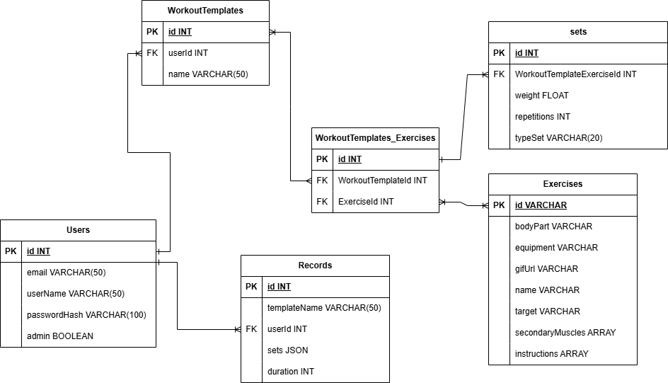

1. Identificar las entidades del sistema.
1. Identificar los atributos de las entidades.
1. Identificar las llaves primarias y foráneas.
1. Asignar una nomenclatura adeacuada a las entidades y sus atributos.
1. Identificar las entidades pivote del sistema.
1. Identificar los catálogos del sistema.
1. Identificar los tipos de relaciones del sistema.
1. Crear el Modelo Entidad-Relación del sistema.
1. Crear el Modelo Relacional de la base de datos del sistema.
1. Identificar los tipos de dato de los atributos de las entidades el sistema.
1. Identificar los atributos que puedan ser únicos en el sistema.
1. Identificar las reglas de negocio (Operaciones CRUD) del sistema

## Listado de Entidades

### users **(ED)**

- id **(PK)**
- email
- firstName
- lastName
- passwordHash
- admin

### exercises **(EC)**

- id **(PK)**
- bodyPart
- equipment
- gifUrl
- name
- target
- secondaryMuscles
- instructions

### workout template **(ED)**

- id **(PK)**
- userId **(FK)**
- name

### workout template_x_exercise **(EP)**
  
- id **(PK)**
- workoutTemplateId **(FK)**
- exerciseId **(FK)**

### sets **(ED)**

- id **(PK)**
- workoutTemplateExerciseId **(FK)**
- weight
- repetitions
- typeSet

### records **(ED)**

- id **(PK)**
- templateName
- userId **(FK)**
- sets
- duration

## Relaciones

- **user** hasMany **workout template**
- **workout template** belongsTo **user**

- **user** hasMany **record**
- **record** belongsTo **user**

- **workout template** hasMany **set**
- **set** belongsTo **workout template**

- **set** hasOne **exercise**
- **exercise** belongsToMany **set**

## Diagrama Relacional de la DB

## Reglas de negocio

### users

1. Crear un usuario
1. Modificar un usuario
1. Eliminar usuario

1. Obtener usuario(admin)
1. Obtener todos los usuarios(admin)

### exercises

1. Obtener ejercicio
1. Obtener todos los ejercicios

1. Crear ejercicio(admin)
1. Modificar ejercicio(admin)
1. Eliminar ejercicio(admin)

### workout template

1. Crear template
1. Modificar template
1. Obtener template
1. Eliminar template

### sets
1. Crear set
1. Modificar set
1. Obtener set
1. Eliminar set

1. Obtener todos los sets(Admin)

### records

1. Crear record
1. Obtener record
1. Eliminar record
1. Obtener todos los sets()

